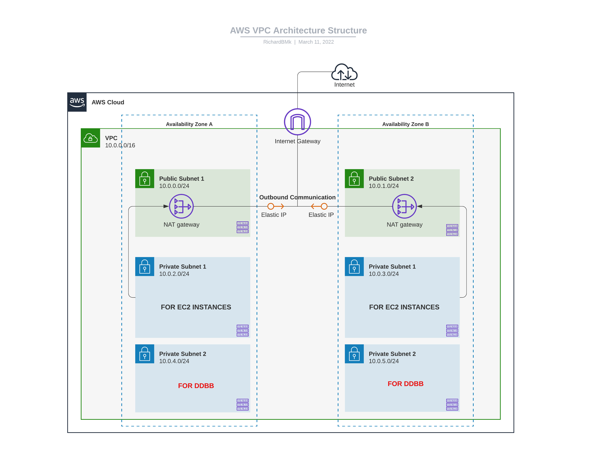

# AWS VPC 3-Tier Architecture



## Folder structure

```
C:.
|   .terraform.lock.hcl
|   architecture01-Networking.jpeg
|   backends.tf
|   locals.tf
|   main.tf
|   notes.txt
|   output-info.txt
|   outputs.tf
|   plan-color.txt
|   plan.txt
|   providers.tf
|   README.md
|   terraform.tfstate
|   terraform.tfstate.backup
|   terraform.tfvars
|   variables.tf
|
+---.terraform
|   +---modules
|   |       modules.json
|   |
|   \---providers
|       \---registry.terraform.io
|           \---hashicorp
|               \---aws
|                   \---3.74.3
|                       \---windows_amd64
|                               terraform-provider-aws_v3.74.3_x5.exe
|
\---modules
    \---networking
            main.tf
            outputs.tf
            variables.tf
```
